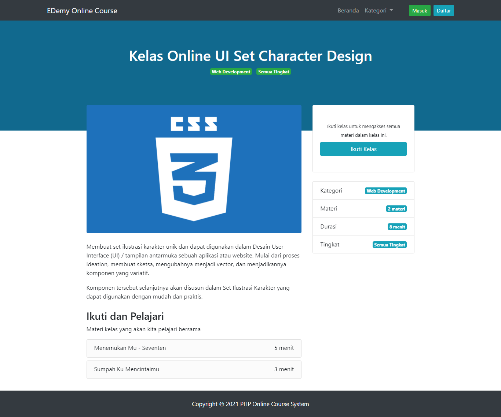
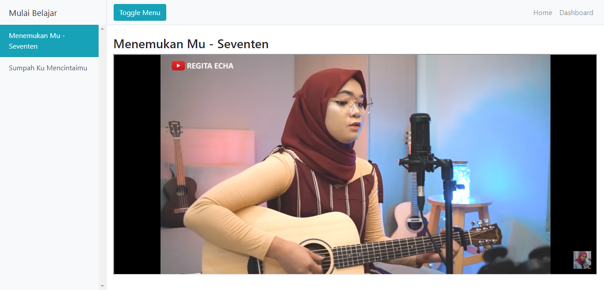

# PHP Online Course
Sistem kursus/kelas online sederhana dengan php (versi 7.3) native oop dan query builder.

## Cara Install
- download project ini secara langsung atau dengan cara git clone (git clone https://github.com/ahmdsya/php-online-course.git) dan simpan dalam folder localhost anda
- edit file config/DB.php sesuaikan dengan informasi database anda
- import php-online-course.sql ke database yg sudah anda buat
- jalankan web anda
- akses halaman admin yaitu localhost/(nama-project)/master

## Screenshot

